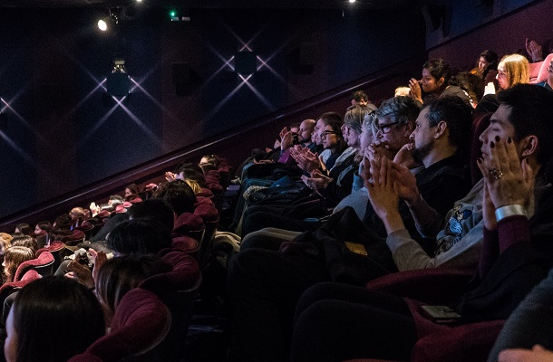

```{r setup, include = FALSE}
# For markdown template
library(tufte)

# Load relevant packages for project
vec_packages <- c("stringr", "tidyselect", "ggplot2", "pander")
pacman::p_load(char = vec_packages, install = TRUE)

# invalidate cache when the tufte version changes
knitr::opts_chunk$set(tidy = FALSE, cache.extra = packageVersion('tufte'))
options(htmltools.dir.version = FALSE)

knitr::opts_chunk$set(results = "asis", warning = FALSE, message = FALSE)

# Load scripts
source("scripts/2018/0 - functions.R")
source("scripts/2018/1.1 - dataImportClean.R")

# Turn off scientific notation
options(scipen = 999, expressions = 10000)

cb_palette <- c("cb_black" = "#000000",
                "cb_grey" = "#999999",
                "cb_orange" = "#E69F00",
                "cb_light_blue" = "#56B4E9",
                "cb_green" = "#009E73",
                "cb_yellow" = "#F0E442",
                "cb_dark_blue" = "#0072B2",
                "cb_red" = "#D55E00",
                "cb_pink" = "#CC79A7")

rm(vec_packages)
```

# Executive Summary
```{r (HIDE) Exec Summary (also in 1.1 Rating - text), echo = FALSE, include = FALSE}
source("scripts/2018/2.1 - reportRating.R")
source("scripts/2018/2.2 - reportRecommend.R")
source("scripts/2018/2.3 - reportEthnicity.R")
source("scripts/2018/2.4 - reportMotivation.R")
source("scripts/2018/2.5 - reportRetention.R")
```
```{r Exec Summary - side-image, echo = FALSE, fig.margin = TRUE}

```
From the post-film survey data, the key findings drawn from those who have attended the festival and filled out a survey are:

**`r toString(paste0(txt_rating * 100, "%"))` rated their LEAFF experience to be "Very good" or "Good".**

**`r toString(paste0(txt_recommend * 100, "%"))` enjoyed LEAFF so much that they would recommend a friend or colleague to attend LEAFF.**

**Most of the audience were from an `r toString(txt_ethnicity)` ethnic background. This shows LEAFF is `r toString(txt_ethnicity_conc)` the attendance of ethnic minority groups.**

***`r toString(txt_motivation)`* were the top three reasons why they wanted to attend LEAFF.**

**`r toString(paste0(txt_retention_new * 100, "%"))` said this is their first time coming to the festival, showing that LEAFF was `r toString(txt_retention_stay[2])` in attracting new audience members and retaining previous members.**

***

# Introduction
```{r Intro - side-image, echo = FALSE, fig.margin = TRUE}
knitr::include_graphics('pictures/director.jpg')
```
> _The London East Asia Film Festival (LEAFF) is the largest film festival of its kind in London, introducing the diversity of East Asian culture though film. Our world needs, more than ever before, a medium to bridge cultural understanding. There is no better way than through film. LEAFF represents a culmination of the most inspiring, engaging and inclusive cross-cultural programming. LEAFF brings the best of East Asian cinema every year to the capital and aims to champion the growing collaboration in East Asian filmmaking._
>
> `r quote_footer('--- Hyejung Jeon, Festival Director')`

`r newthought('This paper analyses the data')` collected from the London East Asia Film Festival (LEAFF) 2019. It does so with the intention of providing a summary of how successful the event was, and to provide a benchmark for future editions 

***
# Section 1: Quotes from the Audience
```{r Quotes - side-image, echo = FALSE, fig.margin = TRUE}

```
`r newthought("This section presents")` some of the comments made by audience members who have attended LEAFF 2019.

> _"Lots of fun, both film & extra activities."_

> _"Interesting, engaging and enjoyable."_

> _"Great experience with great films."_

> _"AMAZING! So much fun!!"_

> _"Very enjoyable & comfy!"_

> _"Best day in my life"_

> _"Phenomenal"_

> _"Inspiring"_

> `r quote_footer('--- LEAFF 2019 audience members')`

***

# Section 2: Key Performance Metrics
`r newthought("This section presents")` key analyis of the festival's performance data.

## Section 2.1: How much did the audience enjoy LEAFF?
```{r (SHOW) 2.1 Rating - plot, echo = FALSE, fig.margin = TRUE, fig.cap = "Figure 1", fig.width = 5, fig.height = 4}

# Create levels so we capture all responses and in right order
lvls <- c("Very good", "Good", "Average", "Poor", "Very poor")

data_rating <- data_rating %>% 
  filter(Response == 1) %>% 
  # select only columns we need
  select(Selection, Response) %>% 
  # force factor order
  mutate(Selection = factor(x = Selection, levels = lvls))

# Plot the rating
func_plot_counts_percents(x = data_rating, 
                          col_x = "Selection",
                          colour_fill = cb_palette[["cb_green"]], 
                          plot_title = "Rating of Experience", 
                          plot_title_x = "How would you rate your experience of LEAFF 2019?")
```
+ In **Figure 1**, `r toString(paste0(txt_rating * 100, "%"))` of attendees rated their LEAFF experience as being **Very good** or **Good**.

+ This demonstrates that `r toString(txt_rating_conc[1])` attendees enjoyed LEAFF and that the programme and activities which were part of this were `r toString(txt_rating_conc[2])` in capturing the public's interests and appetite for film and cinema.

## Section 2.2: How likely are the audience to recommend LEAFF to friends and colleagues?
+ In the table below, `r toString(paste0(txt_recommend * 100, "%"))` of respondents said they were either **Very likely** or **Likely** to recommend a friend or colleague to attend LEAFF.

+ This `r toString(txt_recommend_conc)` the findings made in *Section 2.1* where `r toString(paste0(txt_rating * 100, "%"))` of respondents said their experience of LEAFF was **Very good** or **Good**. 

```{r (SHOW) 2.2 Recommend - table, echo = FALSE, fig.margin = TRUE}
pander(x = table_future, 
       caption = "_Likelihood of audience recommending LEAFF to friends or colleagues_")
```

## Section 2.3: Is LEAFF appealing to minority ethnic groups in London?
```{r (SHOW) 2.3 No. ofscreenings - plot, echo = FALSE, fig.margin = TRUE, fig.cap = "Figure 2", fig.width = 5, fig.height = 4}

# Create levels so we capture all responses and in right order
lvls <- c("White - British", "White - European", "Black - African / British", "Black - Caribbean / British",
          "South Asian", "East Asian / South East Asian", "Arab", "Other (please state)", "Prefer not to say")

data_ethnicity <- data_ethnicity %>% 
  mutate(Selection = factor(x = Selection, levels = lvls)) %>% 
  filter(Response == 1)
func_plot_counts_percents(x = data_ethnicity,
                         col_x = "Selection",
                         colour_fill = cb_palette["cb_dark_blue"],
                         plot_title = "Audience Ethnicity",
                         plot_title_x = "What is your ethnicity?")

```
+ In **Figure 2**, the majority of the audience who attended LEAFF and completed the survey are of the **`r toString(txt_ethnicity)`** ethnic group.

+ This shows LEAFF is `r toString(txt_ethnicity_conc)` the attendance of ethnic minority groups to watch film.

## Section 2.4: Why does our audience come to LEAFF?
+ Digging further into why `r toString(paste0(txt_rating * 100, "%"))` of survey respondents enjoyed their LEAFF experience to rate it as **Very good** or **Good**, we see the top three reasons for why they wanted to attend LEAFF were *`r toString(txt_motivation)`*.

+ This demonstrates that LEAFF is more than just a festival that screens films, but it also caters for film fans' other interests.

## Section 2.5: How many previous and new audiences came to LEAFF?
```{r (SHOW) 2.5 Retention - plot, echo = FALSE, fig.margin = TRUE, fig.cap = "Figure 3", fig.width = 6, fig.height = 5}
lvls <- c("This is my first!", "Yes")

func_plot_pie(x = table_retention, col_counts = "Percent", col_category = "Selection_New", 
              plot_title = "Audience Retention", factor_levels = lvls)
```
+ In **Figure 3**, we have `r toString(paste0(txt_retention_new * 100, "%"))` of respondents saying this is their first time coming to the festival. 

+ Of the remaining `r toString(paste0((1 - txt_retention_new) * 100, "%"))` of respondents who have returned from previous festivals, we have the following breakdown:
    - `r toString(txt_retention[1])`
    - `r toString(txt_retention[2])`
    - `r toString(txt_retention[3])`
    - `r toString(txt_retention[4])`

+ As a `r toString(txt_retention_stay[1])` proportion of attendees have returned to LEAFF from previous years, then this demonstrates that previous LEAFFs were `r toString(txt_retention_stay[2])` in encouraging people to return for this year's festival.

***

# Concluding Remarks
```{r Conclusion - side-image, echo = FALSE, fig.margin = TRUE}
knitr::include_graphics('pictures/team.jpg')
```
+ From the data analysed in this report, the key findings are:

**Survey respondents enjoyed LEAFF so much that `r toString(paste0(txt_rating * 100, "%"))` said their experience was *Very good* or *Good*.**

**Survey respondents enjoyed LEAFF so much that `r toString(paste0(txt_recommend * 100, "%"))` of them will recommend a friend or colleague to attend LEAFF.**

**The majority of survey respondents are of the *`r toString(txt_ethnicity)`* ethnic group.**

**The top three reasons for why survey respondents wanted to attend LEAFF were *`r toString(txt_motivation)`*.**

**`r toString(paste0(txt_retention_new * 100, "%"))` of survey respondents said this is their first time coming to the festival, showing that LEAFF was `r toString(txt_retention_stay[2])` in attracting new audience members and retaining previous members.**

```{r bib, include = FALSE}
# create a bib file for the R packages used in this document
knitr::write_bib(c('base', 'rmarkdown'), file = 'skeleton.bib')
```
